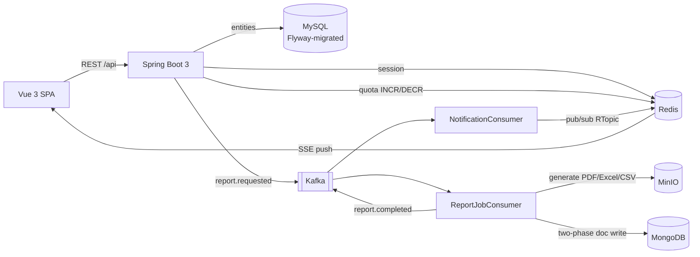

# DocPlatform

A multi-tenant document generation and notification platform. Admins define report templates and assign report tasks; users generate PDF/Excel/CSV reports through an async Kafka pipeline with exactly-once delivery, per-tenant concurrency quotas, and real-time status notifications.


## Architecture



A report request flows: REST controller acquires the tenant's quota slot (Redis atomic counter, HTTP 429 beyond the limit) → publishes a Kafka event → the consumer generates the document, uploads it to MinIO, and records it in MongoDB with a two-phase write so a crash between upload and record never duplicates a report → a completion event fans out to email and in-app notifications, pushed live to the browser over SSE via Redis pub/sub.

## Features

- **Multi-tenancy** — every request is tenant-scoped via a context filter + MyBatis-Plus tenant-line plugin; data isolation is enforced at the SQL layer and covered by Testcontainers integration tests
- **Per-tenant concurrency quota** — Redis atomic counter caps concurrent report jobs per tenant (default 3, configurable per tenant); excess requests get a clean HTTP 429 instead of starving other tenants
- **Exactly-once report delivery** — two-phase MongoDB write makes the Kafka consumer idempotent: on redelivery it reuses the already-uploaded MinIO object or exits silently if the report completed
- **Real-time notifications** — report status pushed to the browser over Server-Sent Events backed by Redis pub/sub (no polling)
- **Report generation** — PDF (Thymeleaf + openhtmltopdf), Excel (Apache POI), CSV (OpenCSV); multi-row data from attached `.csv`/`.xlsx` files
- **Templates & assignments** — admins manage templates (including a Quill rich-text editor for static PDFs) and assign report tasks; users complete them from their dashboard
- **Scheduling** — cron-based schedules (6-field Spring cron, with a friendly builder UI) create report assignments for recipients
- **Session auth** — Spring Security + Spring Session (Redis), role-based access (ADMIN / USER), first registrant in a tenant becomes its admin

## Stack

| Layer | Technology |
|---|---|
| Backend | Java 21, Spring Boot 3, Spring Security, Spring Kafka, MyBatis-Plus, Redisson |
| Data | MySQL (Flyway migrations), MongoDB, Redis, MinIO |
| Frontend | Vue 3, Vite, Pinia, Vue Router, Axios, Quill |
| Delivery | Docker, GitHub Actions CI, images published to GHCR |

## Getting started

### Prerequisites

- Java 21, Maven
- Node 20+
- Docker (for Kafka, Redis, MongoDB, MinIO)
- MySQL 8 running locally on `localhost:3306`

### 1. Infrastructure

```bash
docker compose up -d        # Kafka + Zookeeper, Redis, MongoDB, MinIO
```

### 2. Database

```sql
CREATE DATABASE docplatform;
```

Flyway creates the schema automatically on first boot (`src/main/resources/db/migration`).

Credentials are read from environment variables, with defaults matching the local Docker Compose setup:

| Variable | Default |
|---|---|
| `DB_USERNAME` / `DB_PASSWORD` | `root` / `123456` |
| `MINIO_ENDPOINT` | `http://localhost:9000` |
| `MINIO_ACCESS_KEY` / `MINIO_SECRET_KEY` | `minioadmin` / `minioadmin` |

Set them explicitly for any non-local deployment.

### 3. Backend

```bash
mvn spring-boot:run         # serves the API on http://localhost:8080
```

### 4. Frontend

```bash
cd frontend
npm install
npm run dev                 # Vite dev server, proxies /api to the backend
```

Register a tenant and a user from the UI — the first user registered in a tenant is automatically promoted to admin.

MinIO's console is available at http://localhost:9001 (`minioadmin` / `minioadmin`).

## Testing

```bash
mvn test
```

Unit tests plus a Testcontainers integration suite that boots a real MySQL, runs the Flyway migrations, and verifies mapper CRUD and tenant isolation (requires Docker).

## CI/CD

GitHub Actions runs backend and frontend test jobs in parallel on every push and PR. On `main`, after both pass, a multi-stage Docker build (Maven → JRE runtime) is pushed to `ghcr.io/averyhinazuki/docplatform:{latest,<sha>}`.

```bash
docker run -p 8080:8080 ghcr.io/averyhinazuki/docplatform:latest
```
